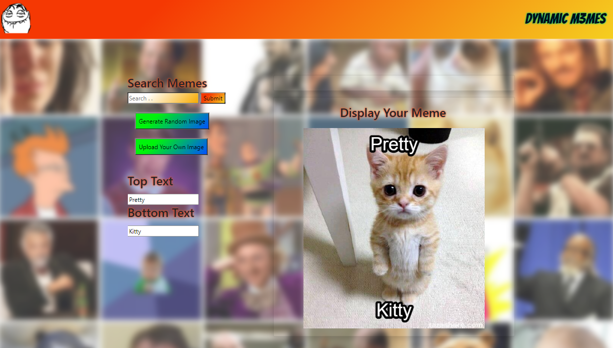

# Dynamic Memes

## User Story

User wants to be able to make a meme that they can use by either searching a database, grabbing a random image or uploading their own.

## Summary Photo

Click here:  to see the screenshot.

## Usage

This is a simple meme generator that allows the user to get images several different ways and add text to create their own meme.

## URL

https://joshjankowski.github.io/Dynamic-Memes/

## Author

Josh Jankowski

## Copyright
All Rights Reserved.